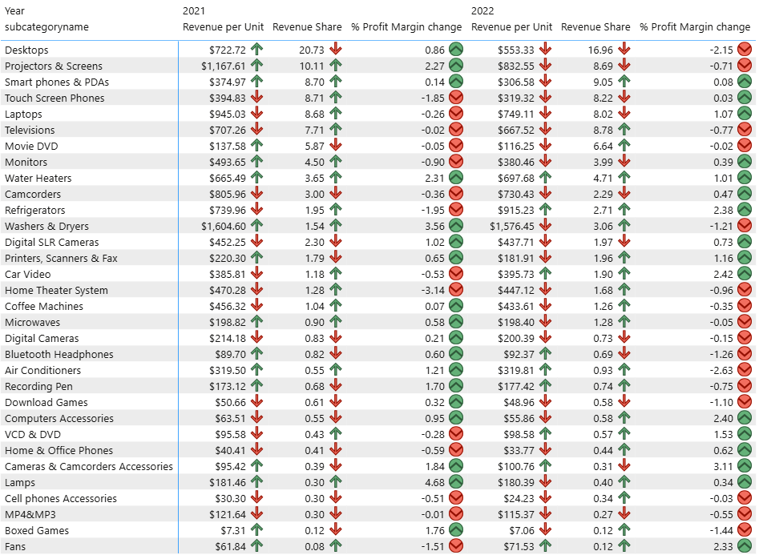
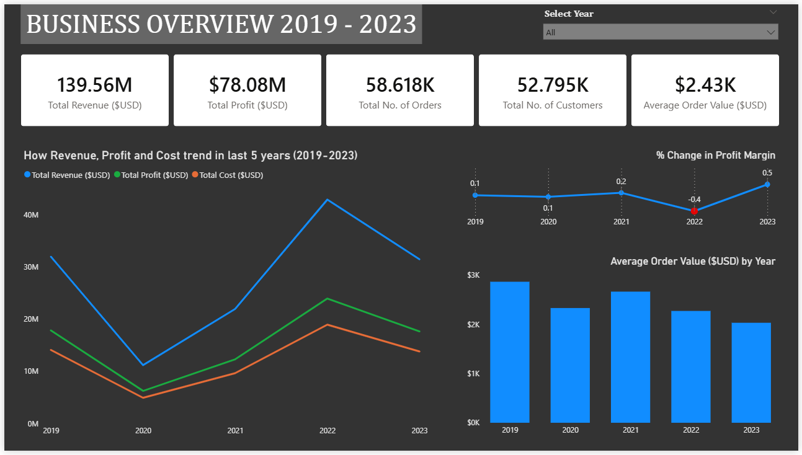
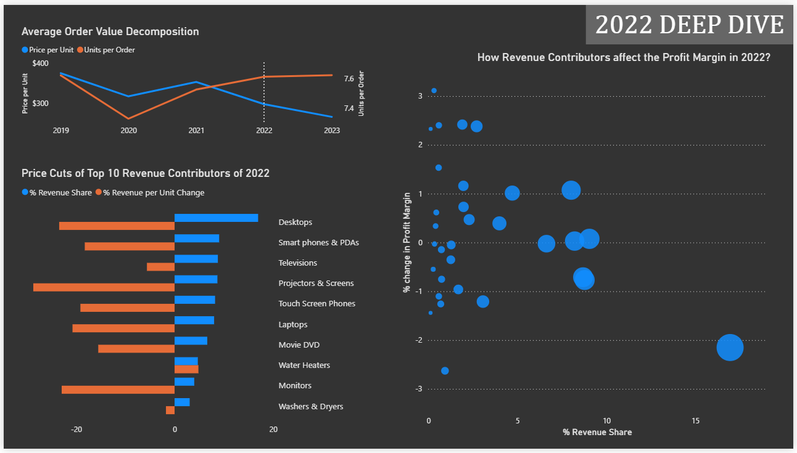
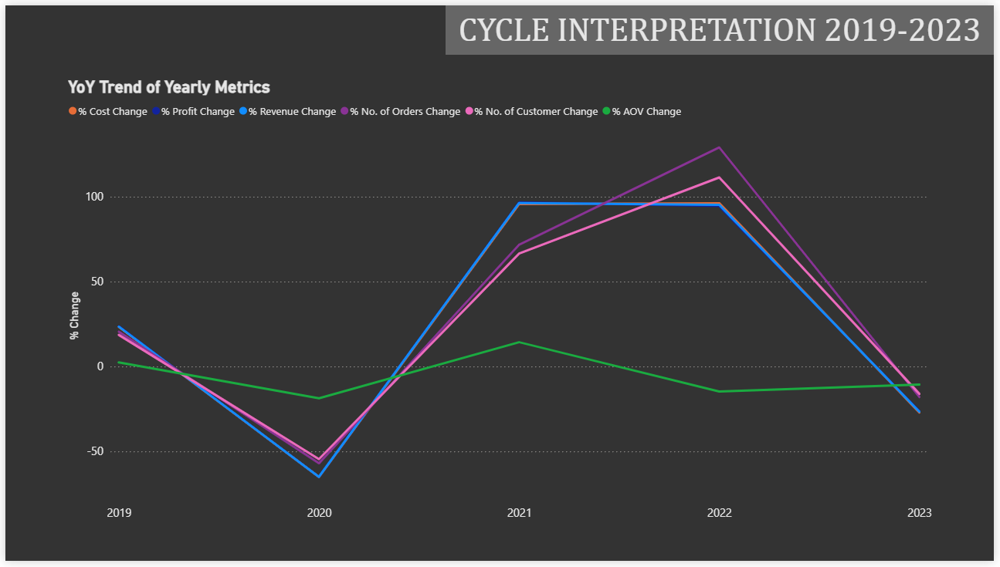

# Sales & Revenue Analysis (2019-2023)

Comprehensive analysis of **Contoso's** five-year business performance (2019-2023). Focusing on **sales performance**; especially revenue trends, pricing strategy, margin resilience, and overall economic cycle behavior.

## Project Objective

This project analyzes a five-year sales cycle (2019-2023) to:

- Analyze revenue, profit, and cost trends  
- Investigate the 2022 order value decline and its drivers  
- Examine product pricing strategy and impact on profit margin  
- Understand margin stability despite broad price cuts 
- Interpret the Economic Cycle reflected in the data

## Tools & Technologies

- PostgreSQL - Data Transformation Layer
- DBeaver - SQL Development 
- Power BI - Dashboard Visualization

## Key Business KPIs

- Revenue ($USD) = (Net Price * Quantity) / Exchange Rate  
- Total Cost ($USD) = (Unit Cost * Quantity) / Exchange Rate  
- Total Profit = Revenue - Cost  
- Profit Margin % = Total Profit / Revenue  
- Average Order Value (AOV) = Revenue / Total Orders  
- Price per Unit = Revenue / Quantity  
- Units per Order = Quantity / Orders  
- YoY Growth % = (Current - Previous) / Previous  

## Data Validation

- Date Range : **2015-01-01** to **2024-04-20**  
- 2024 excluded from analysis (*incomplete year*)
- Missing exchange rates : 0
- Negative or zero prices : None    

# Business Overview (2019 - 2023)

## Year Breakdown

### 2020  
Significant decline across revenue, profit, orders, and customers - consistent with global pandemic disruption.

### 2021  
- Revenue grew **↑ 96.26% YoY**
- Strong rebound across all major KPIs
- Possible demand-driven recovery

### 2022
- Revenue peaked at **$42.9M** with ↑ 95.23% YoY growth
- Peak in orders and customers
- However :
  - **AOV** declined by **↓ 14.74%**
  - **Profit Margin %** slightly compressed by **↓ 0.38%**

*This triggered a deeper investigation*

### 2023  
- Metrics declined to pre-pandemic levels
- Revenue contributions became more distributed
  

## Investigating: 2022 
### AOV Decomposition

Since: 

    AOV = Price per Unit × Units per Order

In 2022:
- Price per Unit: **↓ 15.7%**
- Units per Order: **↑ 1.06%**

*(Interpretation)* 
This indicates that AOV decline was **Price-driven**, not Basket-size driven. 
  

### Product-Level Pricing Strategy

- **23 *out of* 32** product sub-categories experienced **price cuts**
- The max-cut being **↓ 28.7%**
- From **Top 10** sub-categories that saw major cuts, **7** were among the **Top revenue contributors** 

This suggests deliberate repricing of flagship products.

*Likely objectives :*
- *Defend market share*  
- *Accelerate demand*  
- *Strategic competitive positioning*  

However, two questions arise: 

1. How did the **Profit Margin** remain **relatively stable**? 
2. Why were these **specific products targeted** for price-cuts?
  

### 1. Margin Resilience Analysis

Despite broad price cuts:

- Profit Margin declined only **↓ 0.38%**

#### *Why?*

- Some products undergoing price-cuts **positively** impacted the **Profit Margin %** 
- Revenue contribution redistributed across categories

#### Weighted Profit Margin Impact

    Weighted Profit Margin = % Margin Change × % Revenue Share

*(Both faced major price cuts)*
- **Desktops :** ↓ 36.46% impact  
- **Laptops :** ↑ 8.58% impact

*(Interpretation)*  
Margin stability was supported by **diversified contribution** and **strategic balancing** across product tiers. 
  

### 2. Strategic Price Targeting

Several **Top revenue contributors of 2021** were among the **Top Price cutters of 2022**. 

This *suggests* targeted repricing of flagship categories. *Likely* to defend market share and/or stimulate demand.

  

## Business Cycle Interpretation

The 2019–2023 period reflects a managed economic cycle:

**2019:** Pre-disruption Baseline 
**2020:** Contraction 
**2021:** Demand-driven Recovery 
**2022:** Strategic Expansion & Price Compression 
**2023:** Rebalancing & Normalization  

The observed trends suggest a **structured and potentially strategic response to economic disruption** rather than purely reactive volatility.
   

# Dashboard Preview

Page 1 – Executive Overview 
- KPI summary (Revenue, Profit, Orders, Customers, AOV)
- 5-year trend analysis 
- Profit margin change highlight 
- AOV trend visualization

  

Page 2 – 2022 Deep Dive 
- AOV decomposition 
- Top 10 revenue contributors & price changes 
- Revenue Share vs Margin Change scatter plot

  

Page 3 – Economic Cycle Interpretation 
- YoY metric trend visualization 
- Contraction → Recovery → Strategic Compression → Stabilization
   

# Data Modeling Approach

To maintain clean separation of logic:

***SQL → Modeled Views → Visualization***

- The **transformation layer** was built using **SQL views**: 
    - Order-level base calculations 
    - Yearly aggregation layer 
    - Window-function-based YoY calculations 
    - Contribution analysis by sub-category 
    - Weighted margin impact modeling 
- **Power BI** was used strictly as a **visualization layer** 

---
---
