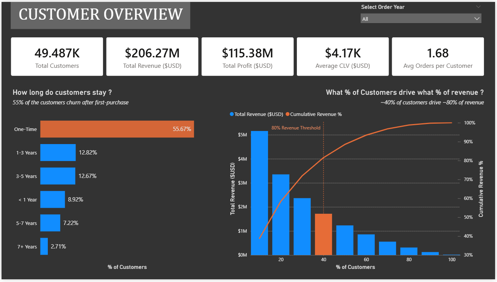
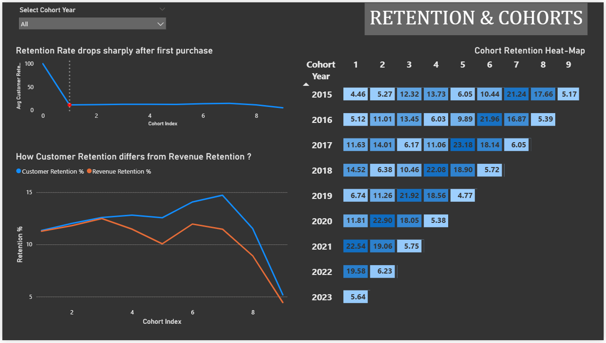
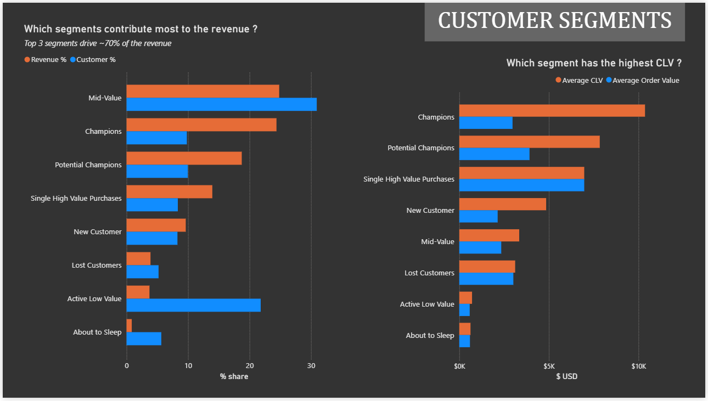
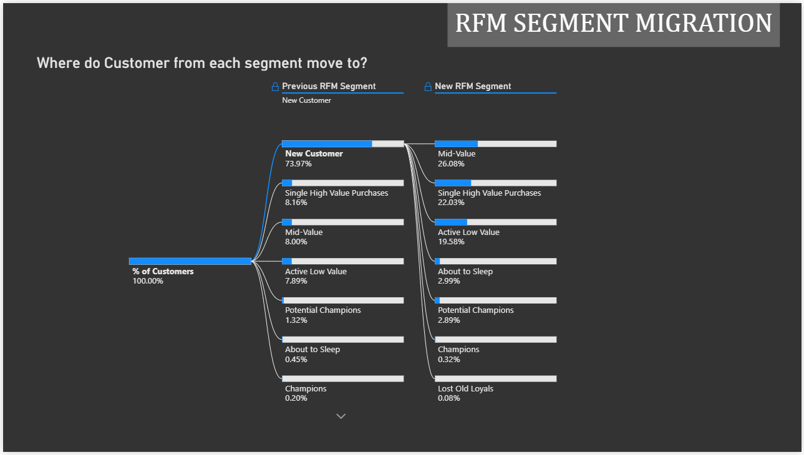

# Customer Behavior & Lifecycle Analysis (2015-2024)

Comprehensive analysis of **Contoso’s customer base** focusing on retention patterns, customer lifetime value, revenue concentration, and behavioral segmentation.

This project explores how customers **acquire, behave, evolve, and churn over time**, and identifies key opportunities to improve long-term value.

## Project Objective

This analysis aims to:

- Understand customer retention and churn behavior  
- Identify how revenue is distributed across the customer base  
- Segment customers based on value and engagement  
- Analyze how customers transition across lifecycle stages  
- Uncover opportunities to improve Customer Lifetime Value (CLV)  

## Tools & Technologies

- PostgreSQL - Data Transformation Layer  
- DBeaver - SQL Development  
- Power BI - Dashboard Visualization  

## Key Business Metrics

- Customer Lifetime Value (CLV) = Total Revenue per Customer  
- Average Orders per Customer = Total Orders / Total Customers  
- Customer Retention Rate = Returning Customers / Total Customers  
- Revenue Retention Rate = Revenue retained from returning customers  
- Customer Share % = Segment Customers / Total Customers  
- Revenue Share % = Segment Revenue / Total Revenue  

## Data Validation

- Date Range: **2015-01-01 to 2024-04-20**    
- Total Customers: **~49K**  
- No major data quality issues identified     

# Customer Overview

## Initial Observations

- **55.67%** of customers are **One-time buyers**  
- Among retained customers, **25.49%** have an active lifespan of **1-5 years**
- Revenue distribution follows a **Pareto pattern**, where **38.2% of customers drive 80% of total revenue**

*(Interpretation)*  
This indicates a **high dependency on a relatively small customer base**, while a large portion of acquired customers fail to convert into repeat buyers.    

# Retention & Cohort Behavior

## Retention Drop-Off 

Initial analysis revealed a significant retention challenge:

- Only **11.34%** of customers return for a second purchase the next year  
- Post first purchase, retention stabilizes at ~**12% per cohort**

This indicates that the **largest drop-off** occurs **immediately after acquisition**.

## Customer Retention *vs* Revenue Retention

- Revenue retention is **consistently lower** than customer retention  
- Only a few cohorts (2015, 2020) briefly show slightly higher revenue retention  

*(Interpretation)*  
Returning customers are **not spending as much over time**, indicating a decline in customer value despite retention.

## Cohort Heatmap Insights

- Retention increases later in cohorts, especially in years 2021 and 2022 of each cohort
- 2022 showed a notable **improvement (~22% average retention)** in each cohort  

*(Interpretation)*  
Improved retention during 2022 suggests that **pricing strategy** may have **positively influenced repeat purchase behavior**.    

# Customer Segmentation (RFM Analysis)

To better understand customer value distribution, customers were segmented using **RFM (Recency, Frequency, Monetary)** analysis.

## Revenue Contribution by Segment

|RFM Segments|Revenue Share %|Customer Share %|
|---|---|---|
Mid-Value                     |24.82 % |30.94 % |        
Champions                     |24.38 % |9.81 % |        
Potential Champions           |18.74 % |9.96 % |        
Single High Value Purchases   |13.95 % |8.34 % |

 

- Together they generate **~82% of total revenue**. 
- Champions & Potential Champions **contribute heavily** despite **lower customer share** 

 

> **Single High Value purchase** customers show **high purchase value *but* low retention**, representing a ***strong opportunity*** for conversion into loyal customers.

## CLV & AOV Insights 

| RFM Segments | CLV *($USD)* | AOV *($USD)* |
|---|---|---|
|Champions                  |$ 10364.17|$ 2972.33|
|Potential Champions        |$ 7838.36 |$ 3919.18|
|Single High Value Purchases|$ 6972.32 |$ 6972.32|

*These segments also have the highest AOVs*    

# Customer Lifecycle & Migration

Customer behavior over time reveals lifecycle patterns.

**Typical Decline Path:**

    New Customer → Mid-Value → Active Low-Value → About to Sleep

**Typical Growth Path:**

    New Customer → Mid-Value → Potential Champions → Champions

*(Interpretation)*  
- **Most** customers **gradually decline** in engagement and value
- A **smaller segment** successfully **progresses into high-value** categories    

# Key Insights

**1. Retention is the Primary Challenge**
- Majority of customers churn after first purchase  
- Long-term retention remains low  

**2. Revenue is Highly Concentrated**
- ~38% of customers drive ~80% of revenue  
- Strong Pareto distribution observed  

**3. Pricing Strategy May Influence Retention**
- Higher retention observed in 2021–2022 in each cohort  
- Aligns with pricing changes observed in Sales & Revenue Analysis  

**4. High-Value Segments Drive Business Performance**
- Champions, Potential Champions, and Mid-Value customers dominate revenue  

**5. High-Value One-Time Buyers Are Untapped Potential**
- High spend but low retention  
- Strong candidates for targeted retention strategies  

**6. Most Customers Follow a Declining Lifecycle**
- Only a small segment transitions into high-value groups    

# Dashboard Preview

**Page 1 - Customer Overview**
- KPI summary (Customers, Revenue, Profit, CLV, Orders per Customer)  
- Lifetime distribution  
- Pareto revenue distribution  

 

**Page 2 - Retention & Cohorts**
- Survival curve  
- Customer Retention *vs* Revenue retention  
- Cohort heatmap  

 

**Page 3 - Customer Segments**
- Revenue *vs* Customer share  
- CLV & AOV comparison across segments  

 

**Page 4 - RFM Segment Migration**
- Customer movement across segments  
- Lifecycle transition patterns  
   

# Data Modeling Approach

To maintain a structured analytical workflow:

***SQL → Modeled Views → Visualization***

- The **transformation layer** was built using **SQL views**: 
  - Cohort creation & retention tracking  
  - Survival curve modeling  
  - Revenue contribution analysis
  - RFM segmentation    
  - Segment migration tracking  

- **Power BI** was used strictly as the **visualization layer**

---
---
